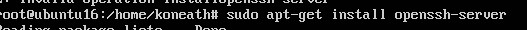
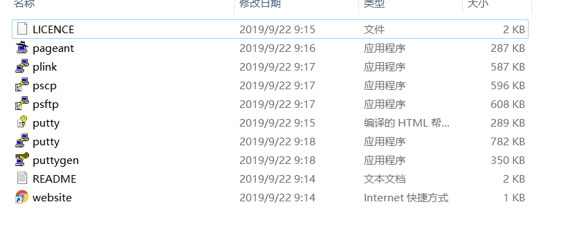
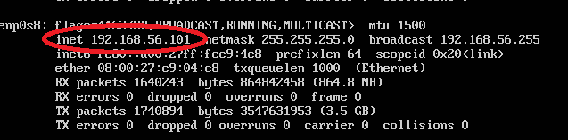
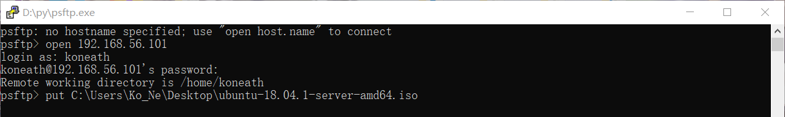
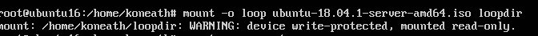
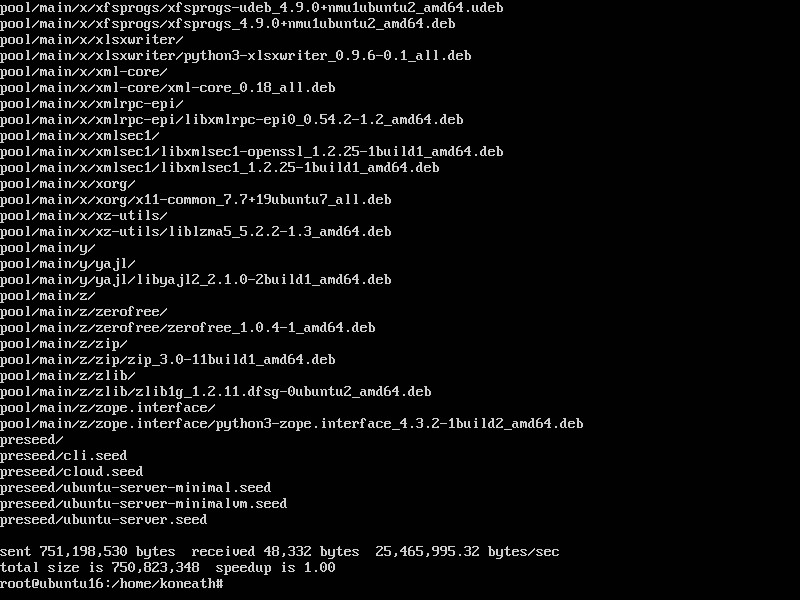
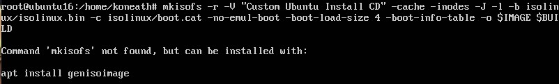
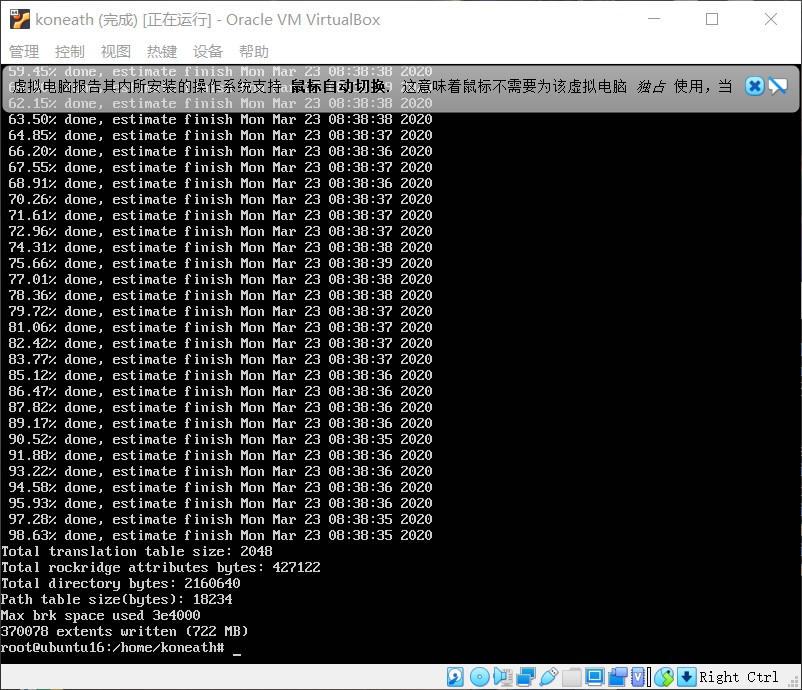
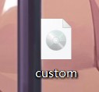

# 第一次作业   
    无人值守安装Ubuntu
## 流程
    1. 安装Ubuntu18.04
    2. 配置SSh和putty
    3. 在Ubuntu环境下制作镜像
    4. 安装

## 1.安装Ubuntu18.04
 ### [实验资料]( https://www.bilibili.com/video/av86360030 )
    *严格按照实验资料内的实验步骤安装
## 2.配置ssh和putty
### [前提：双网卡](https://www.bilibili.com/video/av86360440)
(1). 安装SSh服务


*
(2). 下载并安装putty


*
(3). 使用ifconfig活着ip a 得知主机ip地址

*
(4). 链接psftp
   *open 192.168.56.101
   *put原始安装iso

*

## 3.在Ubuntu环境下制作镜像
(1). 输入代码
`mount -o loop ubuntu-18.04.1-server-amd64.iso loopdir`

*
发现问题：文件夹只读
使用下图代码写入：

*
(2). 同步iso
`rsync -av loopdir/ cd`

*
(3). 卸载iso
`umount loopdir`
(4). 进入目标工作目录；编辑Ubuntu安装引导界面增加一个新菜单项入口
`cd cd/`
`vim isolinux/txt.cfg`
* 添加以下内容到txt.cfg
```
label autoinstall
  menu label ^Auto Install Ubuntu Server
  kernel /install/vmlinuz
  append  file=/cdrom/preseed/ubuntu-server-autoinstall.seed debian-installer/locale=en_US console-setup/layoutcode=us keyboard-configuration/layoutcode=us console-setup/ask_detect=false localechooser/translation/warn-light=true localechooser/translation/warn-severe=true initrd=/install/initrd.gz root=/dev/ram rw quiet
  ```
(5). 使用教师给予的.seed文件，并将其复制到/cd/preseed/

*
(6). 使用以下代码重新生成md5验证
`cd ~/cd && find . -type f -print0 | xargs -0 md5sum > md5sum.txt`

(7). 生成自动安装镜像
```
IMAGE=custom.iso
BUILD=~/cd/

mkisofs -r -V "Custom Ubuntu Install CD" \
            -cache-inodes \
            -J -l -b isolinux/isolinux.bin \
            -c isolinux/boot.cat -no-emul-boot \
            -boot-load-size 4 -boot-info-table \
            -o $IMAGE $BUILD
```
出现错误：

*
无法找到指令mkisofs,可以通过安装genisoimage来解决:
`apt install genisoimage`

解决问题后成功生成镜像：

*
(8). 使用psftp从虚拟机中取出镜像

*
## 4.安装
[安装录屏]()
未上传


# 参考资料
https://github.com/CUCCS/linux-2019-Wzy-CC/pull/1/commits/84f0cfd7dc9e78c0e0497a3adfa15eec3d190733

https://github.com/c4pr1c3/LinuxSysAdmin/blob/master/chap0x01.exp.md#%E5%AE%9E%E9%AA%8C%E6%8A%A5%E5%91%8A%E8%A6%81%E6%B1%82

https://blog.csdn.net/a1194821568/article/details/102891850

https://blog.csdn.net/sinat_34166518/article/details/83112201


